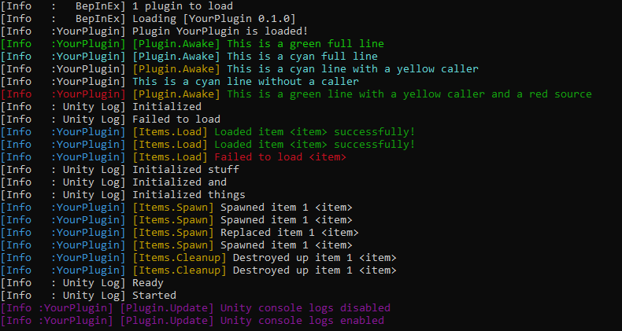

# ConsoleTools
A lightweight console utility for BepInEx plugins that adds colored output and caller information.  
  
  
### Output

  
  
### Usage
```cs
using ConsoleTools;
using ConsoleTools.Patches;


public partial class Plugin : BaseUnityPlugin
{
    internal static ManualLogSource Log { get; private set; } = null!;


	private void Awake()
	{
		Log = Logger;
		
		ConsoleConfig.Register(Name);
		ConsoleConfig.ShowUnityLogs = true;     // default: true
		ConsoleConfig.SetLogging(Name, true);   // default: true

		harmony.PatchAll(typeof(ConsoleLogListenerPatches));

        Log.LogColor("This is a green full line", ConsoleColor.Green, oneColor: true);
        Log.LogColor("This is a cyan full line", ConsoleColor.Cyan, oneColor: true);
        
        ConsoleConfig.SetDefaultCallerColor(ConsoleColor.DarkYellow);
        Log.LogColor("This is a cyan line with a yellow caller", ConsoleColor.Cyan);
        Log.LogColor("This is a cyan line without a caller", ConsoleColor.Cyan, callerInfo: false);
        
        ConsoleConfig.SetDefaultSourceColor(ConsoleColor.DarkRed);
        Log.LogColor("This is a green line with a yellow caller and a red source", ConsoleColor.DarkGreen);


		// Set default source and caller config for all ConsoleConfig.LogColor()
        ConsoleConfig.SetDefaultSourceColor(ConsoleColor.DarkYellow);
        ConsoleConfig.SetDefaultCallerColor(ConsoleColor.DarkCyan);
	}


    private void Update()
    {
        // Toggle Unity logs
        if (Input.GetKeyDown(KeyCode.F5))
        {
            ConsoleConfig.ShowUnityLogs = !ConsoleConfig.ShowUnityLogs;
            Log.LogColor($"Unity console logs {(ConsoleConfig.ShowUnityLogs ? "enabled" : "disabled")}",
                ConsoleColor.DarkMagenta);
        }
    }
}
```
